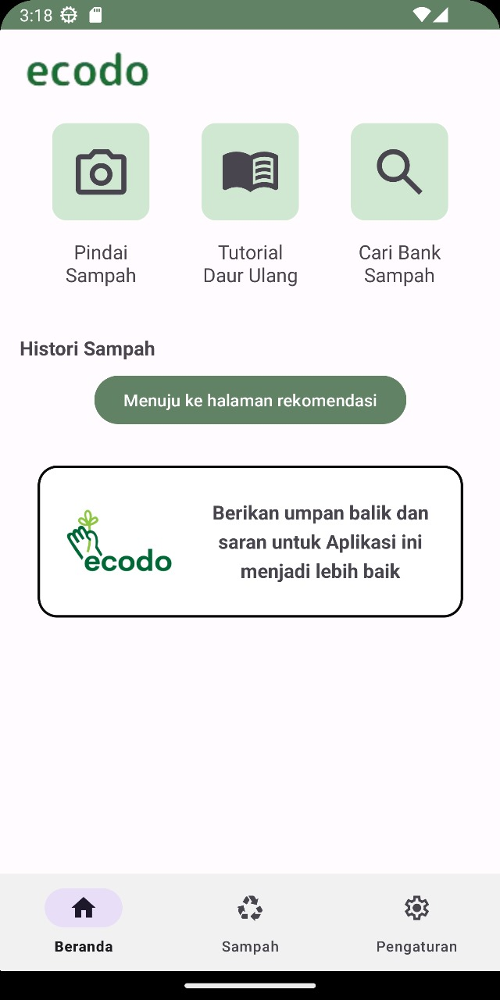
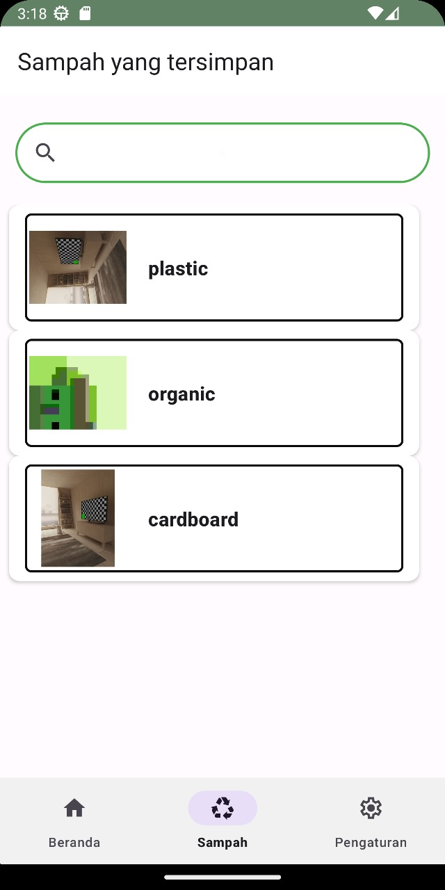
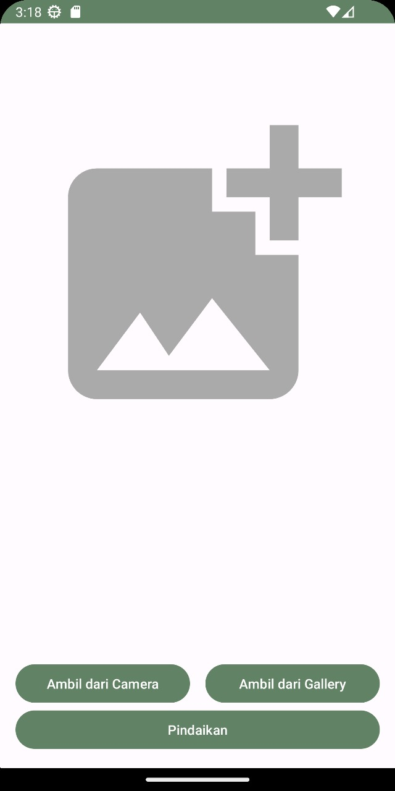
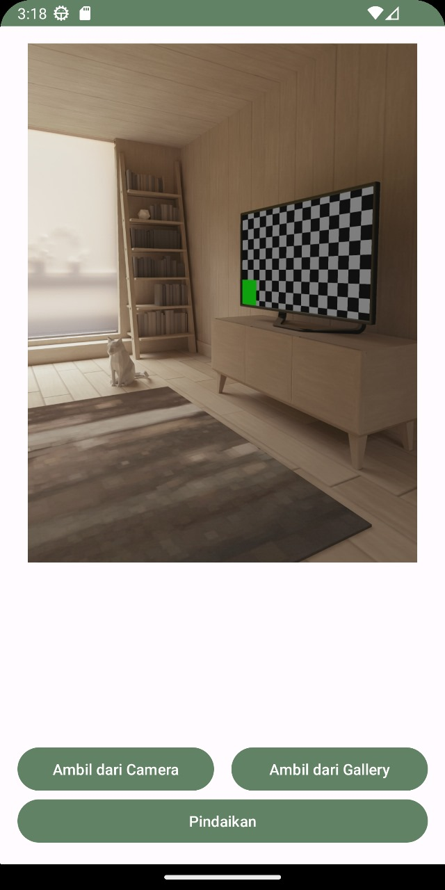
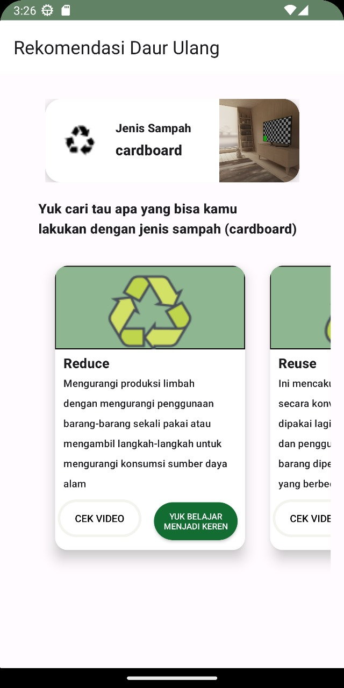
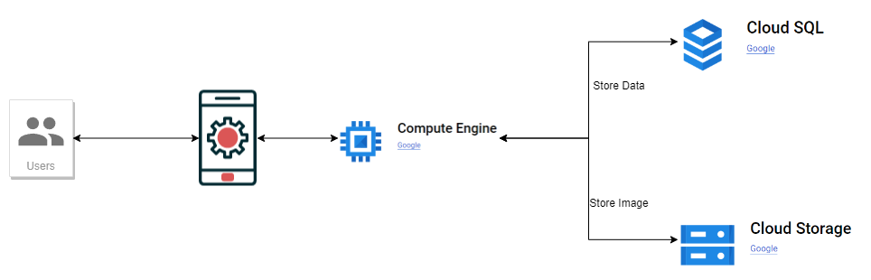
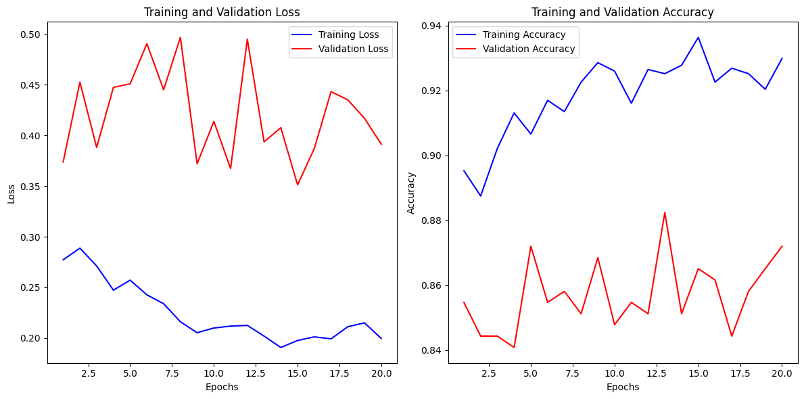

# Ecodo
## Bangkit 2023 batch 2  Product Capstone
<h3>welcome to Ecodo</h3>

Ecodo is a user-friendly application aimed at simplifying waste management, promoting recycling, and engaging the community in proactive efforts to maintain a clean and sustainable environment. We are aware of the urgency in addressing waste management issues, and with Ecodo, we hope to empower individuals, local governments, and environmentalists with a powerful and easy-to-use platform to achieve real waste reduction and environmental preservation.

# Our Team

### Team ID: CH2-PS288

| Name                     | Bangkit ID    | Learning Path       | GitHub Link                               |
|--------------------------|---------------|---------------------|-------------------------------------------|
| Dheo Putranta Pandia     | M390BSY0141   | Machine Learning    | [GitHub Profile](https://github.com/dheepss123)  |
| Rida Meyda Sari          | M013BSX0350   | Machine Learning    | [GitHub Profile](https://github.com/meyyrida35)  |
| Abdullah Azzam           | M547BKY4506   | Machine Learning    | [GitHub Profile](https://github.com/Abdulazzam1)|
| Galuh Wira Relungwangi    | C390BSX3916   | Cloud Computing     | [GitHub Profile](https://github.com/Relungwangi)|
| Muhammad Fathan Hari     | C269BSY3457   | Cloud Computing     | [GitHub Profile](https://github.com/MFathanH)   |
| Fauzan Rizkyana Gunawan  | A152BSY2093   | Mobile Development  | [GitHub Profile](https://github.com/fauzanrizkyanag)|
| Bintang Abillah Safna    | A120BSY2224   | Mobile Development  | [GitHub Profile](https://github.com/BintangSafna)|

# Project Documentation
<!DOCTYPE html>
<html lang="id">
<head>
</head>
<body>
  

<h3>Mobile Development (MD) : </h3>
<h5>Screen Shoot APP</h5>
  
  
  
  
  
  

   
  

  <h3> Cloud computing (CC) : </h3>
  <h5> cloud computing architecture design</h5>
  
  

   
  

  <h3> Machine Learning (ML) : </h3>
  <h5> Machine Learning Model and Training History</h5>
  
Model Information

  <table border="1" cellpadding="8">
    <tr>
      <th>Layer (type)</th>
      <th>Output Shape</th>
      <th>Param #</th>
    </tr>
    <tr>
      <td>mobilenetv2_1.00_224 (Functional)</td>
      <td>(None, 7, 7, 1280)</td>
      <td>2257984</td>
    </tr>
    <tr>
      <td>global_average_pooling2d_1 (GlobalAveragePooling2D)</td>
      <td>(None, 1280)</td>
      <td>0</td>
    </tr>
    <tr>
      <td>dense_2 (Dense)</td>
      <td>(None, 128)</td>
      <td>163968</td>
    </tr>
    <tr>
      <td>dropout_1 (Dropout)</td>
      <td>(None, 128)</td>
      <td>0</td>
    </tr>
    <tr>
      <td>dense_3 (Dense)</td>
      <td>(None, 6)</td>
      <td>774</td>
    </tr>
    <tr>
      <td colspan="2">Total params</td>
      <td>2422726 (9.24 MB)</td>
    </tr>
    <tr>
      <td colspan="2">Trainable params</td>
      <td>164742 (643.52 KB)</td>
    </tr>
    <tr>
      <td colspan="2">Non-trainable params</td>
      <td>2257984 (8.61 MB)</td>
    </tr>
  </table>
   
  
  

</body>
</html>
 

# Tech Stacks

# How use this app?

### Demo with upload image:

Feel free to explore each team member's GitHub profile for more information about their contributions and projects.

